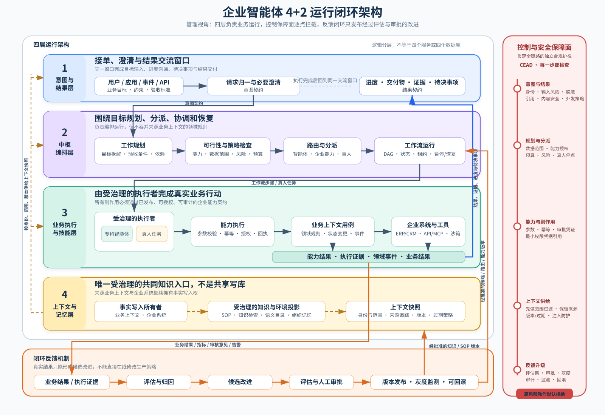
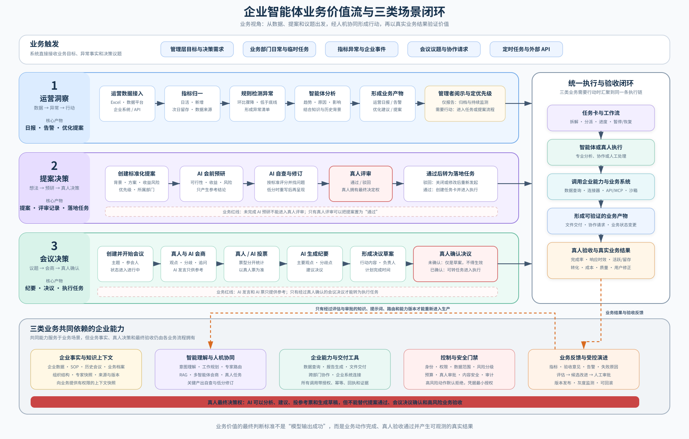
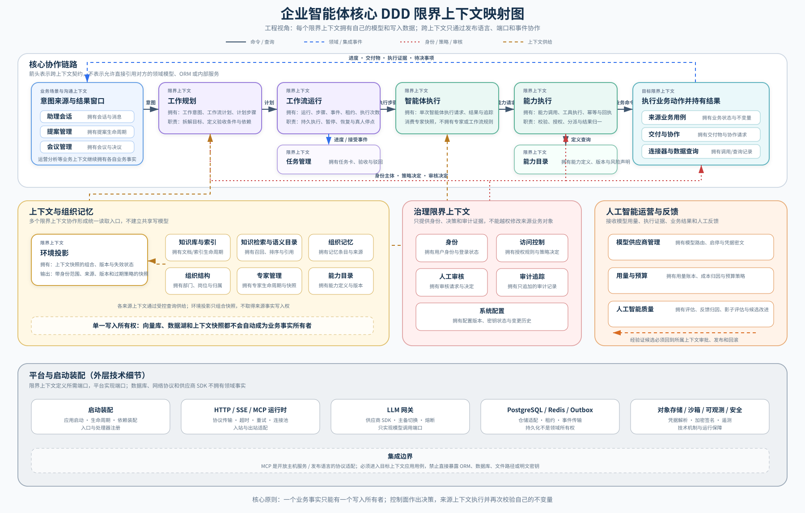

# 20 · 企业智能体四层架构与 DDD 领域边界规范

> 状态：P0～P4 与全量验证已完成（2026-07-23）。
> 范围：定义“四层运行架构 + 两大横切支撑系统”、DDD 限界上下文、数据所有权、Context 内分层、
> 依赖方向和迁移路线。
> 目标形态：模块化单体，不因概念分层直接拆微服务，不改变现有 API 与 durable runtime 语义。
> 相关事实源：工作流持久化、租约、幂等和真人停点以 `docs/14-任务编排层设计.md` 为准；本文负责
> 系统架构语义、领域边界和代码依赖规则。
> 生效规则：本文是后端运行模块、领域边界、数据所有权和依赖方向的事实源。`docs/02-总体架构设计.md`
> 中原“七层技术架构”仅保留为历史技术视图；与本文冲突时以本文为准。

## 0. 实施状态

本规范按模块化单体渐进落地，不以一次性移动全部文件为验收标准：

| OpenSpec 阶段 | 状态 | 当前结果 |
|---|---|---|
| P0：基线与架构护栏 | 已完成 | 应用 import graph、无循环、Context 向内依赖、单向 facade 和无副作用包初始化已有回归测试；旧异常 facade 已移除 |
| P1：Proposal Management 参考切片 | 已完成 | Proposal 的 Domain/Application/Ports/SQLAlchemy adapter/Entrypoint 已落地，旧 Service 仅作单向兼容入口 |
| P2：Expert、Agent、Capability | 已完成 | 专家快照、Agent 纯请求/结果、Capability Catalog/Execution 端口与当前 runtime adapter 已分离 |
| P2：Planning、Workflow Runtime、Task | 已完成 | Planning 与 durable Runtime 已分界，step 执行已拆分，Workflow/Task 通过幂等事件协作，旧 workflow 模块只能单向委托 |
| P3：Identity、Organization、Knowledge、Environment | 已完成 | 身份、组织/专家快照、访问决策、Wiki/Index/Retrieval/Semantic/Memory 与 ContextSnapshot 边界已落地 |
| P3：Communication、Meeting、Analytics、Governance | 已完成 | 助理会话、群消息、协作请求、会议、运营分析及 Audit/Review/Quality/Budget/Configuration 边界已落地 |
| P4：HTTP Entrypoints 与前端 Feature | 已完成 | Group Chat 与大页面拆分已完成；迁移 route 已使用 Context entrypoint，且不再直接依赖 ORM、旧 Service、具体 Agent/LLM 或 Context infrastructure |
| 文档与全量验证 | 已完成 | Ruff、Mypy、683 个非交付 Pytest、前端 28 tests/lint/build、`035_channel_member` 单一 head、app/worker smoke 与 Graphify 代码架构复核均通过 |

迁移期 `app/api/core/models/schemas/services/agents/knowledge/llm/integrations` 中尚有历史入口。新实现必须进入
对应 Context 或 Platform；仍有调用方的旧模块只能向新实现单向委托或 re-export，新模块禁止反向依赖
兼容 facade。仓库内静态调用清单、已删除的零调用 facade 与退出条件见 11.3～11.5。Graphify 增量图为
9,950 个节点、24,762 条边，代码与文档/PNG 已刷新；按本次交付要求，17 个演示 SVG 保留为待选语义更新，
不影响代码依赖、写入所有权和质量门验收。

## 1. 总体架构结论

### 1.1 必须同时区分三种架构视图

本系统只有一套实现，但必须从三个正交视图描述。三者回答不同问题，禁止再用同一张“分层图”混为一谈：

| 视图 | 结构 | 回答的问题 | 是否直接对应目录 |
|---|---|---|---|
| 系统运行视图 | 四层 + 两大横切系统 | 一个目标如何被接收、规划、执行、治理并学习 | 否 |
| DDD 领域视图 | Business/Foundation Bounded Context + Context Map | 谁拥有规则、状态、数据和公开语言 | 只对应叶子 Context |
| 代码依赖视图 | Contracts/Domain/Application/Entrypoints/Infrastructure + Platform/Bootstrap | 源码依赖应指向哪里，技术细节放在哪里 | 是 |

因此：

- “意图层”不是 `intent/` 大包；它可能由业务 Context 的 Entrypoint、Assistant Conversations 和
  Work Planning 的输入契约共同实现；
- “编排层”不是一个万能 `orchestration_service.py`；它由 Work Planning、Workflow Runtime、
  Task Management 等多个限界上下文协作完成；
- “记忆底座”不是所有 Context 共写的数据库；它是统一、受治理的上下文获取入口，源事实仍由各 Context
  分别拥有；
- “控制面”和“反馈闭环”不是调用链末端的两个普通模块，而是贯穿四层的独立护栏与演进机制；
- `domain/application/infrastructure` 是单个 Context 内部的代码层，不能拿来替代四层运行架构。

### 1.2 四层运行架构 + 两大横切支撑系统



图采用纵向四层结构，第一层内部同时展示目标接入和结果交付，避免把同一个交流窗口误解成两个独立层。
中枢编排层明确分派给智能体、企业能力或真人；业务执行层通过受治理的能力契约产生业务动作和证据；
上下文与记忆层横跨前三层提供带身份范围、来源、版本和过期策略的上下文快照。右侧控制保障面表示每个
关键节点的强制检查，底部反馈闭环只允许经过评估、审批和版本发布的改进重新进入生产系统。

独立文件：[SVG 矢量图](diagrams/20-enterprise-agent-4-plus-2.svg) ·
[PNG 汇报图](diagrams/20-enterprise-agent-4-plus-2.png)

四层是主运行链路；上下文与记忆层为意图、编排和执行提供统一的事实读取与上下文组装能力。控制面拦截每个
关键决策点，反馈闭环消费全过程证据。它们共同构成“4 + 2”架构，而不是六个按顺序调用的普通 Service。

### 1.3 不可破坏的架构规则

1. 用户给出的是业务目标、约束和预期结果，不要求用户预先拆成机械指令；
2. 编排层负责规划、路由和运行协调，不直接吞并各业务 Context 的领域规则；
3. 执行层只能通过已注册、版本化、可授权的 Capability 调用工具和企业系统；
4. 上下文系统提供统一读取语言，但不取消来源 Context 的数据写入所有权；
5. 高风险副作用必须在执行前完成身份、权限、数据范围、风险和审批检查；
6. 每次输出必须能够关联意图、计划、执行证据、数据来源、模型/能力版本和审计记录；
7. 反馈只能形成“候选改进”，不得绕过评估、版本、审批和发布流程直接修改生产 Prompt、策略或权限；
8. 运行架构的逻辑分层不等于进程、服务或数据库拆分，当前目标仍是模块化单体。

## 2. 六大系统模块的规范定义

### 2.1 意图与结果层（Intent Layer）

**定位：** 系统的接单窗口、澄清窗口和结果交付窗口。

**接收：** 用户、前端应用、企业事件、定时任务或外部 API 提交的宽泛业务目标，同时捕获：

- `principal`：谁以什么身份发起；
- `business_goal`：希望改变什么业务状态或回答什么问题；
- `expected_outcome`：预期结果、格式和验收标准；
- `constraints`：时间、成本、数据范围、合规和禁止事项；
- `context_refs`：会话、业务对象、附件、数据源等引用；
- `channel`：HTTP、SSE、消息、Webhook、CLI 等来源；
- `risk_hints`：是否可能涉及外发、写入、资金、隐私或其他高风险动作。

这些字段构成逻辑上的 `IntentEnvelope`。它是边界 DTO，不默认成为共享领域 Entity。

**输出：** 面向调用者的 `ResultEnvelope`，至少包含结论、产物、证据/引用、完成状态、未解决事项、需要人工
决定的项目以及可追踪 ID。

**负责：** 身份接入、请求归一、必要澄清、进度呈现、结果解释和验收回传。

**不负责：** 自己拆解 durable workflow、直接调用数据库/LLM/Tool、保存 WorkflowStep 真相或决定业务对象
是否生效。来源业务 Context 仍拥有业务命令和最终不变量。

### 2.2 中枢编排层（Orchestration Layer）

**定位：** 围绕业务目标进行规划、分派、协调、恢复和结果汇总的管理大脑。

逻辑角色包括：

- **Supervisor**：保持目标、约束、计划状态和全局完成条件；
- **Task Decomposer / Planner**：把意图转换为可验证的 `WorkflowPlan`；
- **Router / Dispatcher**：根据能力、数据范围、风险、成本和可用性选择 Agent、Capability 或真人；
- **Workflow Runtime**：负责 DAG、状态、租约、attempt、重试、暂停、恢复和真人停点；
- **Result Synthesizer**：把各步骤证据整理为可交付结果，但不能伪造缺失证据。

这些名称是运行角色，不自动等于一个类、一个智能体或一个限界上下文。DDD 上至少由 Work Planning、
Workflow Runtime、Task Management 及来源业务 Context 协作实现。

编排层必须在规划前向上下文系统请求受权限约束的 `ContextSnapshot`，并把验收标准、依赖、执行者类型、
所需能力、风险级别、人工节点和失败策略写进计划。运行真相源继续使用 PostgreSQL durable runtime；
LangGraph 或其他推理框架只能作为 Planner/WorkflowEngine adapter，不能创建第二套状态真相源。

编排层不直接读取其他 Context 的 ORM，不直接调用具体供应商 SDK，也不能为了“智能”绕过 Capability
Execution、权限检查、幂等记录和真人审批。

### 2.3 业务执行与技能层（Agent Skills / Enterprise Capability）

**定位：** 系统的手和脚，负责在授权范围内完成可验证的业务行动闭环。

包含：

- 专科智能体及其版本化专家快照；
- Capability/Skill/Tool 的定义、授权、幂等和执行记录；
- 企业业务 Context 提供的 application use case；
- ERP、CRM、数据平台等企业子系统的开放接口；
- Connector、外部 API、MCP Server 和代码执行沙箱；
- 交付物、协作请求和其他产生真实副作用的执行能力。

术语必须区分：

- **Agent**：在一次执行中使用模型、上下文和能力完成任务的受治理执行者；不是一个共享万能领域模型；
- **Expert**：可版本化的角色、职责、模型策略、知识范围和能力授权配置；
- **Capability**：面向编排层发布的稳定业务能力契约；
- **Skill**：Capability 的一种可复用流程/认知实现，可以不产生副作用；
- **Tool**：Capability 的可调用执行形式，尤其需要参数校验、授权、幂等和结果归一；
- **MCP**：发布资源与能力的边界协议/适配方式，不是领域层，也不是新的数据所有者。

企业子系统接入采用“领域契约 + MCP/Adapter”的形式：子系统所属 Context 先发布稳定的 command/query/result
语言，MCP Server 或其他 adapter 再把协议请求翻译为该 Context 的 Application Use Case。禁止 MCP handler
绕过 Application 直接暴露数据库、ORM、内部 Service 或密钥；禁止把“能被模型调用”误认为“已被授权”。

每次执行必须返回结构化 `CapabilityResult`，包含状态、业务结果、证据、外部引用、幂等键、错误分类和审计
关联。无证据的自由文本不能单独证明高风险动作成功。

### 2.4 记忆底座与上下文系统（Context System / Memory）

**定位：** 所有智能体获取企业事实、标准、历史和当前环境的唯一受治理入口，是系统主动性的知识基座。

“唯一共同知识源”指统一的查询、权限、语义、引用和上下文组装入口，不表示把所有原始数据复制到一个库，
更不表示允许多个 Context 共同修改同一业务对象。正确结构是：

```text
来源 Context / 企业系统（事实写入所有者）
  → 发布事件、快照或受控查询接口
  → Wiki / Index / Retrieval / Semantic Catalog / Organizational Memory
  → scope filter + provenance + version
  → ContextSnapshot
  → Intent / Orchestration / Agent Execution
```

包含：企业私有数据湖的受控访问、Wiki 与 SOP、向量/全文索引、语义目录、组织与专家快照、历史会议和对话、
组织记忆、运行历史及经批准的策略版本。PostgreSQL、对象存储和向量数据库是 Platform 存储机制，不是领域
事实的自动所有者。

`ContextSnapshot` 至少携带：主体与数据范围、来源引用、版本/时间、用途、相关事实、缺失信息、敏感级别和
过期策略。检索必须先做访问范围过滤，再召回和重排；生成结果必须保留 provenance/citations。

上下文系统不得：把原始 Prompt 注入内容当可信指令、让向量索引覆盖来源事实、把归档 transcript 永久当作
无差别记忆、向调用者泄露无权限数据，或让 Agent 直接跨 Context 查询私有表。

### 2.5 闭环反馈机制（Feedback Loop）

**定位：** 把“系统做了什么”和“现实中是否有效”连接起来的进化引擎。

输入包括业务转化率、点击率、完成时长、成本、质量评分、异常告警、失败分类、人工审核意见、用户修正、
工具结果和模型评估。来源业务 Context 拥有原始业务结果，AI Quality/Usage & Budget/Audit 等 Context 只保存
自己需要的评估记录、指标或不可变证据引用。

标准闭环：

```text
执行证据/业务结果
  → 反馈采集与归因
  → 质量评估、异常检测和根因分类
  → 形成 Prompt/路由/能力/知识/SOP 的候选改进
  → 离线或影子评估
  → 必要的人工审批
  → 版本化发布与灰度
  → 持续监测，可回滚
```

反馈闭环可以更新记忆、评估数据和候选策略，但不得直接修改来源业务事实，不得让模型自行提高权限，也不得
未经验证自动覆盖生产 Prompt、路由、SOP 或安全策略。“自我完善”必须是可评估、可审批、可追踪、可回滚的
受控演进。

### 2.6 控制与安全保障防线（Control & Assurance Plane）

**定位：** 贯穿四层和反馈闭环的独立合规护栏，不是最后一步补做的安全检查。

包含独立数字身份、RBAC + ABAC、数据范围、能力授权、凭据引用、内容安全、Prompt Injection 防护、模型评估、
审计追踪、预算限制、异常熔断和 Human-in-the-loop。

系统采用能力对齐设计（CEAD）约束每次行动：

```text
Principal
  → Role/Attribute Policy
  → Data Scope
  → Capability ID + Version
  → Risk/Side-effect Classification
  → Approval Requirement
  → Credential Scope
  → Execution Evidence
  → Audit Record
```

关键控制点：

1. **意图接入：** 认证主体、租户/组织范围、输入内容和请求风险；
2. **计划生成：** 校验计划中每一步是否可授权、是否需要真人、是否超预算；
3. **能力执行：** 再次校验 principal、ExpertSnapshot、capability、参数、数据范围、幂等和审批凭证；
4. **外部副作用：** 使用最小范围 CredentialRef，禁止模型接触明文密钥；
5. **结果交付：** 事实引用、敏感数据脱敏、内容安全和外发策略；
6. **反馈升级：** 评估集、策略版本、审批、灰度和回滚。

高风险动作默认 fail closed。Human Review 只记录审核请求和决定，来源业务 Context 必须在执行生效动作前重新
校验自己的状态、不变量、权限和审批版本；审批通过不等于业务动作已经成功。

## 3. DDD 边界与代码组织

### 3.1 从六大模块映射到限界上下文

系统模块是运行责任集合，不是限界上下文。下表只表示主要承载关系：

| 系统模块 | 主要 Bounded Context | 说明 |
|---|---|---|
| 意图与结果层 | Assistant Conversations、Group Messaging、各 Business Context Entrypoint | 捕获目标、澄清、呈现进度和结果；不拥有编排运行状态 |
| 中枢编排层 | Work Planning、Workflow Runtime、Task Management | 计划、路由、durable execution、人机任务投影；Supervisor 是运行角色 |
| 业务执行与技能层 | Expert Management、Agent Execution、Capability Catalog、Capability Execution、Connector Management/Execution、Governed Data Query、Deliverable Management、Collaboration Requests 及各 Business Context | 执行并产生证据或业务副作用 |
| 上下文与记忆层 | Wiki Management、Knowledge Indexing/Retrieval、Semantic Catalog、Organizational Memory、Environment Projection、Organization Structure | 统一提供有范围、有版本、有来源的 ContextSnapshot |
| 反馈闭环 | AI Quality、Usage & Budget，以及各来源 Business Context 的 outcome/event | 原始结果仍归来源 Context；反馈模块负责评估、归因和候选改进 |
| 控制与保障面 | Identity、Access Control、Human Review、Audit Trail、System Configuration | 横切所有调用；Platform Security 只实现技术机制 |

Provider Management 为执行和编排提供模型路由快照；其供应商 SDK、熔断和调用实现属于 Platform LLM Gateway。
一个 Context 可以参与多条运行链路，但只能拥有自己定义的模型和写入数据。

### 3.2 限界上下文（Bounded Context）

限界上下文拥有一套明确的语言、模型、规则、数据和公开契约。一个业务事实只能有一个写入所有者。

例如：

- Expert Management 拥有专家生命周期；
- Agent Execution 拥有一次 Agent 执行记录；
- Workflow Runtime 拥有 WorkflowRun/WorkflowStep 状态；
- Task Management 拥有 TaskCard；
- Capability Execution 拥有 ToolExecution；
- Organizational Memory 拥有提炼后的记忆条目，但不拥有产生记忆的会议、会话或业务对象。

它们不能共享一个通用 `Agent/Task/Status/Memory` 领域模型。

### 3.3 业务域、基础底座域、Platform 与 Bootstrap

| 类型 | 回答的问题 | 示例 |
|---|---|---|
| 业务场景域 | 公司正在处理什么业务问题 | 提案、会议、运营分析 |
| 基础底座域 | 多个业务场景共同依赖什么稳定业务能力 | Knowledge、Expert、Capability、Workflow、Identity |
| Platform | 这些能力具体如何连接数据库、网络和供应商 | PostgreSQL、Redis、HTTP、MinIO、LLM Gateway |
| Bootstrap | 选择哪些实现并如何启动系统 | FastAPI app、lifespan、worker、handler 注册 |

Wiki、Expert、Capability、Connector、Workflow 等具有业务语义和生命周期，属于 Foundation Context；数据库、
HTTP client、Redis、对象存储、模型 SDK 和 MCP transport 是 Platform/Adapter 技术实现。

一个能力满足以下信号中的至少三项时，可以成为独立 Foundation Context：

1. 有独立 Aggregate、表或写入所有权；
2. 有自己的业务术语、生命周期或状态机；
3. 有独立的权限、失败、重试或审计语义；
4. 被两个以上业务场景消费；
5. 可以用少量稳定 command/query/event 对外服务；
6. 与调用方有不同的变化原因和变化频率；
7. 替换技术实现不应改变它的业务契约。

“很多地方 import”“文件很长”“可以复用”“接了一个 MCP Server”都不能单独证明它是新领域。禁止把所有
底座能力放进 `foundation/common/core` 大包。

### 3.4 业务域组（Business Area）

业务域组只用于导航，例如 `knowledge`、`execution`、`governance`。域组本身不拥有模型、表或 Service，
组内叶子目录才是限界上下文。域组名称不要求与四层运行架构一一对应。

### 3.5 Context 内代码分层

每个复杂 Context 内部采用：

```text
contracts       对外发布的稳定语言，按需创建
domain          业务规则、不变量、实体和值对象
application     command/query/use case/ports/事务编排
entrypoints     HTTP、事件、Worker、CLI、MCP 等入站适配器
infrastructure  ORM、repository、外部 client、MCP client 等出站实现
```

这里的五层属于“代码依赖视图”，不是前述四层运行架构。简单 Context 可以保持为少量文件，但依赖规则不变；
禁止为了目录整齐预建空层。

### 3.6 Shared Kernel

Shared Kernel 是经多个 Context 共同确认的极小稳定契约，不是新的业务 Context，也不是“共同知识源”或通用
业务代码收容所。当前只包含与传输无关的应用失败分类，不得包含 HTTP status/code、FastAPI、ORM、外部
服务类型、Prompt、ContextSnapshot 或可变领域模型。特定 Context 的业务失败必须使用本地领域语言。

### 3.7 目标目录结构

```text
app/
  bootstrap/
    app.py
    lifecycle.py
    wiring.py

  contexts/
    shared_kernel/
      application_errors.py

    foundations/
      knowledge/
        wiki_management/
        knowledge_indexing/
        knowledge_retrieval/
        semantic_catalog/
        organizational_memory/

      workforce/
        organization_structure/
        expert_management/
        capability_catalog/
        environment_projection/

      execution/
        agent_execution/
        capability_execution/
        work_planning/
        workflow_runtime/
        task_management/
        deliverable_management/

      integration/
        connector_management/
        connector_execution/
        governed_data_query/

      communication/
        assistant_conversations/
        group_messaging/
        collaboration_requests/

      governance/
        identity/
        access_control/
        human_review/
        audit_trail/
        system_configuration/

      ai_operations/
        provider_management/
        usage_budget/
        ai_quality/

    business/
      proposal_management/
      meeting_management/
      operational_analytics/

  platform/
    database/
    outbox/
    http_runtime/
    mcp_runtime/
    llm_gateway/
    cache/
    realtime/
    object_storage/
    sandbox_runtime/
    observability/
    security/
    integrations/
```

`foundations/knowledge` 等域组目录只允许包含子 Context 和说明文档，禁止在域组级创建共享 `service.py`、
`models.py` 或 `domain.py`。

## 4. DDD 基础底座域总表

以下按 DDD 业务域组列出数据所有权，不按四层运行架构重复建目录。各 Context 在运行架构中的主要位置见
3.1；“Foundation”表示跨业务场景复用的业务能力，不表示它是最底部的技术设施。

边界等级：

- **A**：现有代码中已有独立模型、入口、状态或生命周期，应建立独立 Context；
- **B**：先作为强模块隔离，拥有独立 port，达到数据所有权条件后升格为独立 Context。

### 4.1 Knowledge Foundation

| Context | 等级 | 拥有 | 公开能力 |
|---|---|---|---|
| Wiki Management | A | KnowledgeBase、KnowledgeFile、Wiki 页面、版本、范围、机密属性、文档生命周期 | Create/Publish/ArchiveDocument、GetDocument |
| Knowledge Indexing | B | Chunk/Vector 索引 read model、索引版本、重建状态 | IndexDocument、RemoveDocumentIndex |
| Knowledge Retrieval | A | 召回、融合、rerank、引用和检索结果契约 | SearchKnowledge、RetrieveWithCitations |
| Semantic Catalog | B | 业务术语、别名、指标口径和语义映射 | ResolveTerm、ResolveMetric |
| Organizational Memory | B | 记忆条目、来源、提炼、巩固和淘汰策略 | DistillConversation、RecallMemory |

### 4.2 Workforce Foundation

| Context | 等级 | 拥有 | 公开能力 |
|---|---|---|---|
| Organization Structure | A | 部门树、主管、岗位、组织归属和外部组织映射 | GetOrganizationSnapshot、AssignMember |
| Expert Management | A | 专家档案、职责、Prompt 策略、模型策略、知识范围、能力绑定、启停和版本 | GetExpertSnapshot、AssignCapabilities |
| Capability Catalog | A | Skill/Tool 定义、版本、输入输出 schema、风险级别、副作用类型 | ListCapabilities、GetCapabilityDefinition |
| Environment Projection | A | 面向意图、编排和 Agent 的组织/专家/知识/数据源组合快照、版本和失效状态 | BuildContextSnapshot、GetEnvironmentSnapshot、InvalidateSnapshot |

### 4.3 Execution Foundation

| Context | 等级 | 拥有 | 公开能力 |
|---|---|---|---|
| Agent Execution | A | AgentExecutionRequest/Result、AgentTaskRecord、trace、一次执行协调 | ExecuteAgent |
| Capability Execution | A | CapabilityInvocation、ToolExecution、参数校验、授权、幂等、重放和结果归一 | ExecuteCapability |
| Work Planning | A | WorkIntent、WorkflowPlan、PlanStep、规划策略和计划校验 | PlanWork |
| Workflow Runtime | A | WorkflowRun/Step/Event、DAG 推进、attempt/version/lease、恢复和真人停点 | StartWorkflow、ExecuteStep、ResumeWorkflow |
| Task Management | A | TaskCard、分配、负责人、验收、驳回和任务日志 | CreateTask、AcceptTask、RejectTask |
| Deliverable Management | A | Deliverable、ArtifactVersion、对象路径、下载授权和交付状态 | CreateDeliverable、PublishArtifact |

### 4.4 Integration & Data Foundation

| Context | 等级 | 拥有 | 公开能力 |
|---|---|---|---|
| Connector Management | A | Connector、Endpoint、CredentialRef、归属、启停、能力和健康状态 | RegisterConnector、GetConnectorSnapshot |
| Connector Execution | A | ConnectorInvocation、调用策略、限流语义、标准化响应和调用记录 | InvokeConnector |
| Governed Data Query | A | DataCatalog、QueryRequest、SQL guard、Dataset 和查询访问约束 | QueryDataset、DescribeDataCatalog |

### 4.5 Communication Foundation

| Context | 等级 | 拥有 | 公开能力 |
|---|---|---|---|
| Assistant Conversations | A | 真人与助理的一对一会话、消息、流式响应和归档状态 | SendAssistantMessage、ArchiveConversation |
| Group Messaging | A | Channel、Message、Member、未读、附件消息和群归档状态 | SendGroupMessage、ManageMembers |
| Collaboration Requests | A | 跨部门请求、风险级别、授权通道、确认和复核状态 | CreateCollaborationRequest、ReviewRequest |

### 4.6 Governance Foundation

| Context | 等级 | 拥有 | 公开能力 |
|---|---|---|---|
| Identity | A | SysUser、登录身份、JWT identity、飞书绑定和登录状态 | Authenticate、ResolvePrincipal |
| Access Control | A | ResourceGrant、资源可见性政策和访问决策 | CanRead、CanWrite、GrantAccess |
| Human Review | B | ReviewRequest、reviewer、风险等级、审核结果和超时 | RequestHumanReview、RecordReviewDecision |
| Audit Trail | A | 追加式 actor/action/target/result 审计记录 | AppendAuditRecord、QueryAuditTrail |
| System Configuration | B | 可编辑配置、密钥状态、版本和变更历史 | ResolveConfig、UpdateConfig |

Human Review 只拥有“审核请求”的生命周期，不拥有来源业务对象。审核通过后，来源 Context 必须重新校验自己的
状态和不变量，再决定是否生效。

### 4.7 AI Operations Foundation

| Context | 等级 | 拥有 | 公开能力 |
|---|---|---|---|
| Provider Management | A | Provider 卡片、模型档位、主备关系、启停、凭据密文和连通性状态 | GetModelRoute、ManageProvider |
| Usage & Budget | A | LLM 用量、成本归因、部门/用户预算和超限政策 | AuthorizeUsage、RecordUsage |
| AI Quality | B | EvalCase、评分、反馈、影子评估、反思和提示词候选验证 | RunEvaluation、RecordFeedback |

## 5. 关键底座域的边界

### 5.1 Wiki/Knowledge

Wiki Management 与 Retrieval 必须分开：

```text
Wiki Management
  → DocumentPublished event
Knowledge Indexing
  → IndexReady event
Knowledge Retrieval
  → SearchResult + Citations
```

职责边界：

- Wiki Management 决定文档是否存在、是否发布、属于哪个知识空间、谁可见；
- Knowledge Indexing 负责把已发布文档转换成可检索索引；
- Knowledge Retrieval 负责查询、召回、排序和引用；
- Access Control 提供访问决策，但不拥有知识文档；
- Agent Execution 只调用 `KnowledgeSearchPort`，不得直接 import 检索实现。

Knowledge Indexing 暂时可以是 Wiki Management 内的强模块，但必须独立 port 和测试，不能与上传接口、
文档 CRUD、搜索算法混成一个 Service。

### 5.2 Expert

Expert Management 是专家业务资产的唯一所有者：

```text
Expert
  ├─ identity/profile
  ├─ organization assignment
  ├─ duty and prompt policy
  ├─ model policy
  ├─ capability bindings
  ├─ knowledge scope
  └─ version/status
```

Expert Management 对外提供不可变执行快照：

```text
ExpertExecutionSnapshot
  expert_id
  expert_version
  role_and_duty
  system_prompt
  model_policy
  capability_ids
  tool_permissions
  knowledge_scope
```

规则：

- Workflow Runtime 只保存 `expert_id + snapshot/version`；
- Agent Execution 只消费快照，不读取 `AgentRole` ORM；
- Capability Catalog 拥有 Tool/Skill 定义，Expert 只保存 capability ID 和授权策略；
- 专家更新后不得改变历史 Workflow 的执行语义。

### 5.3 Capability Catalog 与 Tool 调用

Tool 不是一段 Python 函数，也不等于外部 API。Tool 是面向 Agent 的稳定业务能力契约。

Capability Catalog 定义：

```text
CapabilityDefinition
  capability_id
  version
  name
  description
  input_schema
  output_schema
  risk_level
  side_effect_type
  required_permissions
  handler_key
```

Capability Execution 执行：

```text
Agent Execution
  → CapabilityRequest
Capability Execution
  → 查 CapabilityDefinition
  → 校验 ExpertSnapshot 授权
  → 校验参数和风险策略
  → 建立 ToolExecution 幂等记录
  → 调目标 Context port
  → 保存结果或错误
  → 返回 CapabilityResult
```

具体 Tool 的业务逻辑必须留在目标 Context：

| Tool | 目标 Context |
|---|---|
| `search_wiki` | Knowledge Retrieval |
| `query_business_data` | Governed Data Query |
| `call_external_api` | Connector Execution |
| `generate_report` | Deliverable Management |
| `request_colleague` | Collaboration Requests |

Capability Execution 只负责目录查找、参数校验、授权、幂等和分发，不拥有 Wiki、数据查询、交付或协作规则。

### 5.4 Connector/API 调用

API 调用必须分为业务配置和技术传输：

```text
Connector Management         业务底座
  - 调用哪个外部系统
  - Endpoint 和能力是什么
  - 使用哪个 CredentialRef
  - 谁可调用
  - 是否启用
  - 健康状态

Connector Execution          业务底座
  - 调用策略和限流语义
  - 输入输出映射
  - 供应商错误归一
  - 调用记录

Platform HTTP Runtime        技术底座
  - DNS/TLS/HTTP
  - timeout/retry
  - connection pool
  - request/response bytes
```

标准链路：

```text
Capability Execution
  → ConnectorInvocation
Connector Execution
  → ConnectorSnapshot
  → Credential Resolver port
  → Platform HTTP Runtime
  → External API
  → 标准化 ConnectorResult
```

禁止让 Tool handler 自行拼 URL、读取环境变量、注入密钥或直接返回供应商 SDK 对象。

### 5.5 企业能力的 MCP 接入边界

MCP 是 Open Host Service/Published Language 的协议适配，不替代 DDD 边界。必须区分两类方向：

```text
出站调用：
Capability Execution
  → 目标 Context Port / Connector Execution
  → Infrastructure MCP Client
  → 外部 MCP Server

入站发布：
MCP Transport
  → Context MCP Entrypoint
  → Context Application Use Case
  → Domain / Repository Port
```

规则：

1. MCP tool/resource 名称必须映射到版本化 `CapabilityDefinition` 或目标 Context 的 Published Language；
2. MCP discovery 必须按 principal、组织、数据范围和能力授权过滤，发现能力不等于获准调用；
3. 入站 MCP Server 不得直接暴露 ORM、表结构、文件路径、环境变量、明文密钥或内部 Service；
4. 出站 MCP client 的传输、连接池、超时和协议错误属于 Platform；业务错误归一属于 Connector/目标 Context；
5. 有副作用的 MCP 调用必须经过 ToolExecution 幂等记录、风险策略、必要审批和审计；
6. MCP 返回内容按不可信外部输入处理，进入上下文或 Prompt 前必须做来源标注、范围检查和注入防护；
7. Agent 只能看到被 Capability Catalog 和 Access Control 联合允许的 MCP 能力子集。

企业各子系统可以逐步以 MCP 暴露能力，但子系统本身仍是业务事实所有者；中枢只保存 ID、版本、快照、调用
记录和自己的 read model，不能借 MCP 复制出第二套写模型。

### 5.6 Agent Execution

Agent Execution 负责一次 Agent 调用的完整协调，但不拥有专家、工作流或 Tool 业务规则。

```text
AgentExecutionRequest
  expert_snapshot
  execution_trace
  task_input
  conversation_context
  knowledge_context

AgentExecutionResult
  status
  content
  capability_requests/results
  usage
  sources
  error
```

建议把当前 `ExecutionContext` 拆成：

- `ExecutionTrace`：workflow/step/attempt/trace/principal 等纯数据；
- `ExecutionPorts`：LLM、Knowledge、Capability、Usage、Clock 等依赖；
- `AgentExecutionRequest`：本次执行输入；
- `AgentExecutionResult`：稳定输出。

Agent Execution 不接收 `AsyncSession`、`AgentRole ORM` 或 FastAPI Request。

### 5.7 Work Planning 与 Workflow Runtime

两个 Context 不能继续混为一个 Workflow Service：

```text
Work Planning
  IntentEnvelope → WorkIntent → WorkflowPlan

Workflow Runtime
  WorkflowPlan → WorkflowRun/WorkflowStep
  → claim/lease/attempt
  → Agent Execution
  → state transition/recovery
```

Work Planning 拥有计划语义，Workflow Runtime 拥有 durable execution 语义。未来 LangGraph 只能实现 Planning 或
WorkflowEngine adapter，不能成为第二套状态真相源。

### 5.8 Task Management 与 Human Review

Task Management 拥有 TaskCard 的人机协同生命周期。Workflow Runtime 拥有 WorkflowStep 的执行生命周期。

```text
WorkflowProgressed
  → Task Management projection
  → TaskCard reported

Human accepts TaskCard
  → TaskAccepted event
  → WorkflowRuntime.AcceptHumanStep
  → Runtime 再次验证 waiting_human
```

Human Review 可统一承载审核请求、审核人、风险等级和决定记录，但不能直接把 Proposal、Meeting、Task 或 Workflow
改成成功状态。业务生效动作始终由来源 Context 执行。

### 5.9 Context System 与 Organizational Memory

“Context System”是由多个 Context 协作提供的统一读取能力，不建立一个拥有所有数据的 `ContextSystem` 聚合：

| 职责 | 所有者 |
|---|---|
| 原始业务事实 | Proposal/Meeting/Workflow/Conversation 等来源 Context |
| 文档生命周期与可见范围 | Wiki Management |
| 索引版本和重建状态 | Knowledge Indexing |
| 召回、排序、引用 | Knowledge Retrieval |
| 术语、别名、指标口径 | Semantic Catalog |
| 提炼后的长期记忆、来源和淘汰策略 | Organizational Memory |
| 面向一次任务的 ContextSnapshot 组合、版本和失效 | Environment Projection |
| 数据访问判定 | Access Control |

标准链路：

```text
Intent/Planning/Agent Execution
  → ContextQuery(principal, purpose, refs, time, budget)
  → Environment Projection
  → Organization/Expert/Wiki/Retrieval/Memory/Data Query ports
  → Access Control decisions
  → ContextSnapshot(facts, citations, versions, missing, expires_at)
```

Organizational Memory 只接收已授权的归档事件或显式记忆命令。记忆提炼失败时可以保留受控来源引用，但不得
默默把未经验证的模型推断升级为企业事实。事实、推断、偏好、摘要和决策必须以类型和置信度区分。

### 5.10 Feedback Loop 与 AI Quality

AI Quality 拥有评估用例、评分、反馈归因、影子评估和候选策略验证；它不拥有业务转化率、Task、Proposal、
Meeting、Prompt 生产配置或访问策略。来源 Context 通过 event/query 提供结果，AI Quality 保存不可变引用和
自己的评估结论。

```text
OutcomeRecorded / ExecutionCompleted / ReviewRecorded
  → FeedbackIntake
  → EvaluationRun
  → ImprovementCandidate
  → ShadowEvaluation
  → PromotionDecision
  → VersionedPolicy/Prompt/Route published by its owning Context
```

不同改进对象必须回到自己的所有者发布：Prompt/Expert 策略归 Expert Management，模型路由归 Provider
Management，Capability 定义归 Capability Catalog，SOP/知识归 Wiki Management，访问规则归 Access Control。
AI Quality 只能建议和验证，不能跨 Context 直接写生产配置。

### 5.11 Control & Assurance Plane 的领域边界

控制面不是一个 `SecurityService` 大类，而是多个治理 Context 与 Platform 机制的组合：

- Identity 解析 `Principal`；
- Access Control 根据主体、资源、动作和环境属性产生 `PolicyDecision`；
- Capability Catalog 声明风险、副作用和所需权限；
- Human Review 管理 `ReviewRequest/ReviewDecision`；
- Audit Trail 追加记录谁在何时基于什么版本做了什么；
- Usage & Budget 决定模型/能力消耗是否可用；
- Platform Security 负责加密、签名、secret resolver、内容过滤等技术实现。

控制面通过明确的 application port 和 policy decision 参与用例，不允许治理 Context 直接修改来源 Aggregate。
审批凭证必须绑定 `principal + action + target + payload_hash + policy_version + expires_at`，防止审批后参数被替换。

## 6. 业务场景域

当前已经形成的业务场景 Context：

| Context | 拥有 | 使用的基础底座 |
|---|---|---|
| Proposal Management | 提案、评审、通过/驳回和转执行意图 | Expert、Agent、Knowledge、Human Review、Work Planning |
| Meeting Management | 会议、议题、参会、投票、纪要和真人决议 | Expert、Agent、Knowledge、Human Review、Work Planning |
| Operational Analytics | 运营指标、异常事实、趋势和分析口径 | Connector、Data Query、Semantic Catalog、Agent、Deliverable |

### 6.1 业务价值流与三类场景闭环



该图面向业务负责人和管理层，展示运营洞察、提案决策、会议决策三条价值流如何形成业务产物，并在需要行动时
汇聚到统一的任务执行、企业能力调用、真人验收和业务结果反馈闭环。图中的真人门禁是领域规则：AI 预研不能
替代提案评审，AI 发言和 AI 票不能替代会议决议确认，模型输出成功也不能替代真实业务结果。

独立文件：[SVG 矢量图](diagrams/20-business-value-loop.svg) ·
[PNG 汇报图](diagrams/20-business-value-loop.png)

### 6.2 场景扩展与边界约束

未来销售、研发、财务、HR 等真实业务流程出现独立规则、数据和生命周期后，再建立对应业务 Context；不能仅因
存在一个部门或专家角色就预建空领域。

以下内容不是业务 Context：

- Desktop/Dashboard：工作台组合入口；
- FastAPI API：传输入口；
- Feishu/ThinkingData client：Platform integration；
- LLM provider SDK：Platform adapter；
- 通用页面、DTO、ORM Base。

## 7. 六模块流转与核心 Context Map

### 7.1 端到端主链路

```text
1. Intent Layer
   用户目标 + Principal + ExpectedOutcome + Constraints
   → IntentEnvelope

2. Orchestration Layer
   IntentEnvelope
   → ContextQuery → ContextSnapshot
   → WorkIntent → WorkflowPlan
   → Policy/Capability/Human feasibility check
   → WorkflowRun

3. Agent Skills / Enterprise Capability
   WorkflowStep
   → ExpertExecutionSnapshot
   → AgentExecution
   → CapabilityExecution
   → Business Context / Connector / MCP / Sandbox
   → CapabilityResult + Evidence + Domain/Integration Event

4. Context System / Memory
   全程提供有权限、有版本、有来源的上下文
   并接收允许归档的事件、结果引用和经验证的知识更新

1. Intent Layer
   ResultEnvelope + Deliverable + Evidence + PendingHumanDecision
   → 用户/应用

Feedback Loop
   Outcome/Event/Metric/Review
   → Evaluation → ImprovementCandidate → 受控发布
```

每一步都带 `principal/tenant/trace/workflow/step/attempt/version` 等必要关联。任何层都不得仅靠自然语言字符串
隐式传递身份、权限、幂等键、审批凭证或业务状态。

### 7.2 核心 Context Map



该图面向工程设计，重点回答“谁拥有模型和写入数据、跨 Context 通过什么契约协作”。上方只保留核心业务
链路；上下文与组织记忆、治理、AI 运营分别独立成区；Platform 与 Bootstrap 位于最外层，只实现 Context
定义的端口，不拥有领域事实。为避免图中连线过载，完整的 command/query/event 关系继续以文字清单为准。

独立文件：[SVG 矢量图](diagrams/20-ddd-context-map.svg) ·
[PNG 汇报图](diagrams/20-ddd-context-map.png)

```text
Proposal Management ─┐
Meeting Management  ─┼─IntentEnvelope/command/event→ Work Planning
Assistant Conversation┘

Work Planning ──ContextQuery────→ Environment Projection
Environment Projection ──query─→ Knowledge Retrieval / Organizational Memory
Environment Projection ──query─→ Organization Structure / Expert Management
Work Planning ──WorkflowPlan───→ Workflow Runtime

Workflow Runtime ──snapshot query──→ Expert Management
Workflow Runtime ──command────────→ Agent Execution
Agent Execution ──context query────→ Environment Projection
Agent Execution ──authorize────────→ Usage & Budget
Agent Execution ──command──────────→ Capability Execution

Capability Execution ──definition query──→ Capability Catalog
Capability Execution ──policy query──────→ Access Control / Human Review
Capability Execution ──command───────────→ Connector Execution / Governed Data Query
Capability Execution ──command───────────→ Deliverable Management / Collaboration Requests
Connector Execution ──adapter────────────→ HTTP/MCP Runtime → Enterprise System

Workflow Runtime ──progress event──→ Task Management
Task Management ──accepted event───→ Workflow Runtime

Wiki Management ──published event──→ Knowledge Indexing
Knowledge Indexing ──ready event────→ Knowledge Retrieval
Conversation/Group Messaging ──archive event──→ Organizational Memory

Provider Management ──route snapshot──→ Platform LLM Gateway
Agent/Capability/Business Context ──usage/outcome/quality event──→ AI Quality / Usage & Budget
AI Quality ──validated candidate──→ owning Context promotion use case
```

### 7.3 横切控制关系

```text
Identity ──Principal──────────────→ 每个 Entrypoint/Application Use Case
Access Control ──PolicyDecision───→ ContextQuery / Plan / Capability / Result Delivery
Human Review ──ReviewDecision─────→ 来源 Context 的重新校验用例
Audit Trail ←─append evidence────── Intent / Plan / Execute / Review / Promote
```

箭头表示 command/query/event 或 policy 契约，不表示允许直接 import 对方的 domain/application/infrastructure，
也不表示控制面可以越过来源 Context 修改业务状态。

## 8. 限界上下文内部代码分层定义

本节是代码依赖视图，不是四层运行架构的再次拆分。

### 8.1 Contracts

职责：当前 Context 对其他 Context 发布的稳定语言。

可以包含：

- 不可变 command/query/result DTO；
- integration event；
- facade/protocol；
- ID、版本和快照。

禁止包含：

- ORM、`AsyncSession`；
- FastAPI Request/Response；
- Context 内部 Entity；
- SQL、HTTP client、供应商 SDK；
- 调用者必须理解的内部执行步骤。

只有存在真实消费者时才创建 Contracts。

### 8.2 Domain

职责：实体、值对象、Aggregate、不变量、业务状态机和领域事件。

依赖规则：

```text
domain → 标准库 + 当前 Context domain
domain ─X→ application / entrypoints / infrastructure / platform / 其他 Context
```

禁止 I/O、数据库操作、环境变量、HTTP、LLM 和供应商类型。

### 8.3 Application

职责：一个明确用例的编排、端口定义、事务边界和 domain event 到 integration event 的转换。

典型用例：

```text
PublishWikiDocument
GetExpertExecutionSnapshot
ExecuteCapability
InvokeConnector
ExecuteAgent
PlanWork
StartWorkflow
AcceptTask
RequestHumanReview
```

Application 定义自己需要的 port，Infrastructure 实现。Application 禁止 import ORM、具体 Repository、FastAPI
和供应商 client。

### 8.4 Entrypoints

职责：把 HTTP、SSE、消息、Worker、CLI、MCP 输入转换成 command/query，并映射输出和错误。

标准形状：

```text
解析输入 → 身份/参数校验 → 构造 command → 调用一个主要 use case → 映射输出
```

Entrypoint 禁止直接查询 Repository、执行 SQL、调用 LLM 或包含业务状态机。

### 8.5 Infrastructure

职责：实现 Repository、Gateway、Clock、EventPublisher、ObjectStorage、MCP Client 等 application port。

可以依赖 SQLAlchemy、Redis、MinIO、httpx 和 Platform；禁止包含核心业务决策，禁止返回 ORM/SDK 对象给内层。

### 8.6 Bootstrap

职责：对象创建、依赖注入、route/handler 注册、lifespan、worker 启停和资源释放。

Bootstrap 是唯一允许同时认识多个 Context 和具体 Infrastructure 的位置，高 fan-out 属于正常现象。

## 9. 依赖规则

### 9.1 Context 内

```text
Entrypoints ─→ Application ─→ Domain
Infrastructure ─────────────→ Application Ports / Domain
Bootstrap ──────────────────→ 全部外层实现
```

### 9.2 Context 间

同步查询默认形状：

```text
调用方 Application
  → 调用方定义的 Port
  → Adapter
  → 被调用方 Contracts/Facade
```

异步协作默认形状：

```text
业务状态 + Outbox 同事务提交
  → Platform Outbox Worker
  → Bootstrap 注册的业务 Handler
  → 下游 Application Use Case
```

上下文组装默认形状：

```text
调用方 Application
  → 调用方 ContextQueryPort
  → Environment Projection facade
  → 来源 Context published query / read model
  → ContextSnapshot + provenance/version/scope
```

治理检查默认形状：

```text
来源 Use Case
  → Policy/Review/Budget Port
  → Governance Context Contract
  → PolicyDecision / ReviewDecision / BudgetDecision
  → 来源 Use Case 重新校验并执行或拒绝
```

### 9.3 数据所有权

1. 一个业务对象只有一个写入 Context；
2. 其他 Context 只保存 ID、不可变快照或自己的 read model；
3. 禁止跨 Context 直接更新对方表；
4. 禁止跨 Context 传递 ORM 或共享可变 Entity；
5. 跨 Aggregate/Context 默认最终一致；
6. 事件消费者必须处理重复、延迟、乱序和版本兼容。
7. ContextSnapshot、索引和向量是带版本的 read model，不得反向覆盖来源事实；
8. Feedback/Evaluation/Audit 只能保存自己的记录或来源引用，不得取得被评估业务对象的写入所有权；
9. 审批、权限和预算结果是一次决策凭证，不是来源 Aggregate 的替代状态。

### 9.4 Platform 依赖

```text
Bootstrap → Context + Platform
Context Infrastructure → Platform
Platform → 第三方技术库

Platform ─X→ 任何业务 Context
Domain/Application ─X→ Platform 具体实现
```

业务 handler 由 Bootstrap 注册到 Outbox/Realtime registry，Platform 不得反向 import 业务模块。
HTTP/MCP/LLM/Sandbox runtime 只负责协议、资源和运行机制；Capability 名称、风险、授权、业务错误和结果语义
必须留在 Context。

## 10. 事务与可靠性

### 10.1 普通短事务

```text
Application Use Case
  → load Aggregate
  → domain behavior
  → save Aggregate
  → append Outbox
  → commit
```

Repository 默认 `flush`，完整用例的 commit 由 UnitOfWork/Application 决定。

### 10.2 LLM、Tool、API、MCP 与 Sandbox 长调用

```text
事务 1：claim/lease/ToolExecution pending → commit
事务外：LLM / Tool / HTTP / MCP / sandbox / object storage
事务 2：校验 owner/version/attempt → 保存结果和后续事件 → commit
```

禁止在等待外部 I/O 时持有长数据库事务。

### 10.3 Outbox

Platform Outbox 只拥有：

- event 存储；
- claim、lease、retry、defer、dead-letter；
- dedupe key；
- handler registry 和分发机制。

Outbox 不得使用 Workflow 专属 `StepExecutionDisposition`，应使用通用结果：

```text
Completed
Deferred(available_at, reason)
RetryableFailure(error)
TerminalFailure(error)
```

### 10.4 全链路追踪与执行证据

Intent、Plan、Workflow、Agent、Capability、Connector/MCP、Deliverable、Review、Feedback 必须能够通过稳定标识
关联。最低追踪字段为：

```text
principal_id / tenant_id / trace_id
intent_id / workflow_id / step_id / attempt
expert_version / capability_id / capability_version
policy_version / approval_id / idempotency_key
context_snapshot_version / source_refs
```

不是每张表都要复制全部字段，但必须能够通过不可歧义的引用还原链路。对外副作用成功至少要有幂等执行记录、
目标系统引用或可验证回执；模型生成的一句“已完成”不能作为成功证据。

## 11. 当前文件目标归属

### 11.1 当前实施 Ownership Map

下表记录 2026-07-23 工作树中已有实现的代码所有权。“已有 Context root”表示 Domain/Application/
Entrypoint/Infrastructure 中至少已有一个可执行切片，不表示所有 HTTP route 或所有历史调用方都已迁移。

| 分组 | 当前 Context owner | 实现根目录 | 主要写入/规则所有权 |
|---|---|---|---|
| Business | Proposal Management | `app/contexts/business/proposal_management` | 提案生命周期、评审、转执行意图 |
| Business | Meeting Management | `app/contexts/business/meeting_management` | 会议、议题、投票、纪要、决议与 Task 转换意图 |
| Business | Operational Analytics | `app/contexts/business/operational_analytics` | 运营指标、异常事实、分析结果 |
| Business | Assistant Conversations | `app/contexts/business/assistant_conversations` | 一对一会话、消息、流式回复与归档协调 |
| Business | Group Messaging | `app/contexts/business/group_messaging` | 频道、成员、消息、未读、附件与归档 |
| Business | Collaboration Requests | `app/contexts/business/collaboration_requests` | 跨部门协作请求与复核状态 |
| Business | Task Management | `app/contexts/business/task_management` | TaskCard 分配、接受、驳回、上报与日志 |
| Business | Work Desktop | `app/contexts/business/work_desktop` | 工作台组合用例；不夺取 Task/Message/Collaboration 的来源所有权 |
| Foundation / Execution | Agent Execution、Capability Catalog、Capability Execution、Work Planning、Workflow Runtime | `app/contexts/foundations/execution/*` | Agent 执行、能力定义/幂等执行、计划语义、durable workflow 状态 |
| Foundation / Knowledge | Wiki Management、Knowledge Indexing、Knowledge Retrieval、Semantic Catalog、Organizational Memory | `app/contexts/foundations/knowledge/*` | 文档、索引 read model、检索结果/引用、语义口径、提炼记忆 |
| Foundation / Workforce | Expert Management | `app/contexts/foundations/workforce/expert_management` | 专家生命周期、能力绑定与版本化执行快照 |
| Foundation / Organization | Organization Structure | `app/contexts/foundations/organization_structure` | 部门树、主管、成员归属与组织快照 |
| Foundation / Identity & Policy | Identity、Access Control | `app/contexts/foundations/identity`<br>`app/contexts/foundations/access_control` | 登录/绑定/Principal 与资源访问决策 |
| Foundation / Context | Environment Projection | `app/contexts/foundations/environment_projection` | 带 scope/provenance/version/missing/expiry 的 ContextSnapshot 组合与失效投影 |
| Foundation / Integration | Connector Management、Governed Data Query | `app/contexts/foundations/integration/*` | Connector 配置/快照与受治理查询/SQL 护栏 |
| Foundation / Governance | Audit Trail、Human Review、AI Quality、Usage & Budget、System Configuration/AI Provider/Connectivity | `app/contexts/foundations/governance/*` | 追加式审计、审核决定、AI 评估、用量预算、系统/模型/连通性配置 |
| Shared Kernel | Application failure categories | `app/contexts/shared_kernel` | 与传输无关的稳定应用失败分类；不拥有 Context 业务规则 |
| Platform / Bootstrap | Database、Outbox、HTTP/LLM/Realtime/Object Storage 等技术机制与组合根 | `app/platform/*`<br>`app/bootstrap/*` | 技术资源、传输与装配；不拥有业务事实 |

当前目录分组与本文早期概念分组不完全一致：Communication、Task 和 Work Desktop 的实现目前位于
`contexts/business` 下。这不改变其叶子 Context 的模型和写入所有权；若后续调整导航分组，必须作为纯目录迁移，
不能借机共享 Domain 模型或产生第二写入者。

### 11.2 历史文件的目标归属

| 当前文件/职责 | 目标 Context/Platform | 说明 |
|---|---|---|
| `models/knowledge.py`、已删除 `knowledge_base_service.py` | Wiki Management | Wiki/文档模型和生命周期已由 published operations 承接 |
| `knowledge/ingest.py`、`embedding.py`、已删除 `chunk.py`、`extract.py` | Knowledge Indexing | 生产兼容入口仅剩索引/embedding；分块与抽取测试已迁入 Context |
| 已删除 `knowledge/retrieval.py`、`rerank.py` | Knowledge Retrieval | 检索、精排和诊断脚本改用 published contracts/operations |
| 已删除 `semantic_service.py` | Semantic Catalog | 术语、别名和指标口径已由 Context public API 承接 |
| `memory_service.py` | Organizational Memory | 消费归档事件生成记忆 |
| `agent_role_service.py`、`AgentRole ORM` | Expert Management | 专家业务模型与 ORM 分离 |
| `skill_registry.py` | Capability Catalog | 能力定义、schema、风险和版本 |
| `tool_dispatcher.py`、`ToolExecution` | Capability Execution | 授权、幂等、调度和执行记录 |
| `agents/base.py::run_agent` | Agent Execution | 输入输出改为纯 DTO，不接收 Session/ORM |
| `agents/contracts.py::ExecutionContext` | Agent Execution | 拆为 Trace、Request、Result、Ports |
| `workflow_planning.py` | Work Planning | 输出 WorkflowPlan |
| `workflow_repository.py` | Workflow Runtime application + infrastructure | 用例编排与持久化分开 |
| `workflow_state.py` | Workflow Runtime domain + application | 状态规则与 lease 协调分开 |
| `workflow_step_executor.py` | Workflow Runtime application | 通过 AgentExecutionPort 执行 |
| `workflow_projection.py` | Workflow Runtime query + Task projection | 按写入所有权拆分 |
| `workflow_event_handler.py` | Workflow Runtime entrypoint | 通用 lease/retry 移到 Platform Outbox |
| `workflow_worker.py` | Bootstrap + Platform Outbox facade | 生命周期和轮询机制分开 |
| `task_service.py`、`models/task.py`、已删除 `legacy_orchestration.py` | Task Management | 状态规则移入 domain；TaskCard fallback 直接进入 Task Management legacy public |
| `deliver_service.py`、`models/deliverable.py` | Deliverable Management | 文件业务生命周期 |
| `data_source_service.py` | Connector Management | DataSource 演进为 Connector 元数据 |
| 已删除 `connectivity_service.py` | System Configuration / Connectivity | 零调用 facade 已移除；连通性用例和 adapter 归 Context |
| `data_query_service.py`、`data_catalog_service.py`、已删除 `sql_guard.py` | Governed Data Query | 查询 facade 尚保留；SQL 护栏测试已迁到 Context public API |
| `integrations/feishu/*`、`thinkingdata/client.py` | Platform Integrations | 底层供应商 client |
| MCP server/client transport、session、codec | Platform MCP Runtime + Context adapter | 协议机制在 Platform；tool/resource 语义归目标 Context |
| 已删除 `desktop_chat_service.py`、`desktop_chat_streaming.py`、`desktop_chat_repository.py` | Assistant Conversations | HTTP、测试和归档脚本统一使用 Context entrypoint/ports |
| 已删除 `desktop_service.py` | Work Desktop | 桌面聚合统一使用 Work Desktop public API |
| `discussion_service.py` | Group Messaging | 频道、消息、成员、未读 |
| `realtime_service.py` | Group Messaging adapter + Platform Realtime | 群语义与 Redis 机制分开 |
| `collab_service.py` | Collaboration Requests | 跨部门请求和复核 |
| `org_service.py`、`org_sync_service.py`、已删除 `org_template.py` | Organization Structure | 模板入口已迁到 Context operations；飞书 client 在 Platform |
| `auth_service.py`、`feishu_login.py` | Identity | 身份和飞书登录映射 |
| `permission_service.py`、已删除 `resource_grant_service.py` | Access Control | Grant CRUD/推导测试已迁入 Context，资源类型约束归 domain |
| `audit_service.py` | Audit Trail | 追加式审计记录 |
| `config_service.py`、`runtime_config.py` | System Configuration + Platform Config | 可编辑配置语义与读取机制分开 |
| `ai_provider_service.py` | Provider Management | Provider 卡片和路由快照 |
| `llm/factory.py`、`fallback.py`、`health.py` | Platform LLM Gateway | 模型调用实现 |
| `llm/usage.py`、预算共享状态 | Usage & Budget | 用量政策与供应商 usage 解析分开 |
| `eval_service.py`、`feedback_service.py`、`reflection_service.py` | AI Quality | 评估和反馈闭环 |
| `environment_service.py` | Environment Projection | 组合 ContextSnapshot、版本、来源引用和事件失效 read model |
| `proposal_service.py` | Proposal Management | 提案业务场景 |
| 已删除 `meeting_service.py`、`meeting_ai_actions.py` | Meeting Management | 会议规则、AI/Task adapter 和测试均使用 Context 正式入口 |
| 已删除 `ops_data.py`、`td_event_service.py`、`anomaly.py` | Operational Analytics | 运营事实/事件别名与异常检测均改用 Context 正式 entrypoint |
| `outbox_service.py` | Platform Outbox | 不包含任何业务 handler |
| 稳定应用失败分类 | Shared Kernel | 不携带 HTTP 元数据；特定业务错误留在所属 Context |
| 应用失败到 HTTP envelope 的映射 | Bootstrap / Context Entrypoint | 全局分类由 Bootstrap 映射，Context 特定错误由自己的 HTTP adapter 映射 |

### 11.3 保留的 Legacy Facade 清单

以 2026-07-23 的 AST import 扫描为准，下列兼容入口仍有仓库内 runtime、测试或脚本调用方，因此必须
暂时保留。“保留”只代表不能立即删除，不代表允许在其中新增业务规则。

| 边界 | 保留的兼容入口 | 当前调用证据与退出方向 |
|---|---|---|
| Agent runtime | `app/agents/base.py`、`skills.py`、`tool_dispatcher.py` | Context infrastructure、workflow runtime 和测试仍使用旧 callable/SkillResult 形状；迁到 Agent Execution/Capability ports 后删除 |
| Agent 包级兼容 | `app/agents/__init__.py` | 当前无 eager re-export，但 `from app.agents import base/ops/scheduler/skills` 仍存在；所有调用改为叶子 Context 后可删除包级兼容语义 |
| Identity / Organization / Expert | `auth_service.py`、`feishu_login.py`、`org_service.py`、`org_sync_service.py`、`org_template.py`、`agent_role_service.py` | bootstrap、脚本和特征测试仍有调用；HTTP 与 Environment Projection 已改用 Identity/Organization/Expert published operations |
| Governance / Configuration | `audit_service.py`、`permission_service.py`、`config_service.py`、`ai_provider_service.py`、`eval_service.py`、`feedback_service.py` | bootstrap、Context adapters 和测试仍依赖；HTTP 已改用 Audit/Access Control/System Configuration/AI Quality command/query ports |
| Knowledge | `app/knowledge/embedding.py`、`ingest.py`、`storage.py` 及无 eager re-export 的 `app/knowledge/__init__.py` | runtime adapters、probe/smoke 和测试仍使用旧索引、存储或 embedding 路径；继续迁入 Knowledge/Platform gateway |
| Knowledge / Data service | `memory_service.py`、`data_source_service.py`、`data_catalog_service.py`、`data_query_service.py` | Environment/skill adapter 和测试仍有调用；替换为 Knowledge、Connector Management 和 Governed Data Query published operations |
| Communication / Business | `collab_service.py`、`discussion_service.py`、`proposal_service.py` | skill/runtime adapter 或测试仍使用；替换为各 Business Context operation/event contract |
| Task / Workflow | `task_flow.py`、`task_service.py`、`orchestration_service.py`、`workflow_planning.py`、`workflow_projection.py`、`workflow_recovery.py`、`workflow_repository.py`、`workflow_service.py`、`workflow_state.py`、`workflow_step_executor.py`、`workflow_worker.py` | Agent scheduler、assistant adapter 和 durable runtime 测试仍有调用；生产 worker 与事件路由已移到 Bootstrap，旧 worker 入口仅保留兼容测试缝 |
| Operational probes | `metrics_service.py`、`workflow_event_handler.py` | 生产入口已直接使用 Bootstrap-owned adapter；旧路径仅保留无业务逻辑的兼容导出，完成外部弃用核对后删除 |
| Platform Outbox | `outbox_service.py` | Group Messaging adapter 与架构/durable 测试仍使用旧入口；改为 Platform Outbox repository/dispatcher 公开边界 |

除上表 facade 外，`app/agents/contracts.py`、`legacy_skill_adapters.py`、`runtime_adapters.py`、`skill_registry.py`、
`ops.py`、`scheduler.py`、`workflow_engine.py` 仍是 Agent 迁移桥接；`collab_protocol.py`、
`deliver_service.py`、`environment_service.py`、`query_skill.py`、`realtime_service.py`、`reflection_service.py`
仍包含横向实现或组装职责。它们不是“零逻辑 facade”，
不得在未迁移所有权和特征测试前直接删除。

### 11.4 静态调用分类与零调用证据

扫描范围为仓库内 Python 文件，包括 `app/`、`tests/`、`scripts/` 和 migration/tooling；同时用全仓
文本检索复核模块字符串引用。它能证明仓库内调用，但无法自动证明仓库外插件、手工运维命令或第三方
使用者已停止调用。

**仍有 runtime 调用，必须保留：** 其余大多数 facade；典型证据包括 `app/bootstrap/lifecycle.py` 调用
Provider/Login/Workflow worker facade，以及多个 Context infrastructure adapter 仍调用 `app.agents.base` 或
历史 Service 作为外层适配缝。`app/api/deps.py` 已直接使用 Identity/Access Control published operations。

**仅有测试或脚本调用，不是零调用：**

- `app.agents.scheduler`;
- `app.services.org_sync_service`.

该入口仍需先迁移组织同步特征测试和外部同步调用，再重新扫描；不能为了获得“零调用”而直接删掉对兼容
行为有价值的测试。

**已确认零调用并在 P4 删除：**

- `app/services/connectivity_service.py`;
- `app/services/desktop_chat_repository.py`;
- `app/services/feishu_oauth_config.py`;
- `app/services/feishu_oauth_store.py`;
- `app/services/meeting_ai_actions.py`;
- `app/services/tool_execution_service.py`.

**本轮确认零调用并删除：**

- Knowledge shim：`chunk.py`、`extract.py`、`rerank.py`、`retrieval.py`、`scope.py`；
- Business facade：`desktop_service.py`、`desktop_chat_service.py`、`desktop_chat_streaming.py`、
  `meeting_service.py`、`ops_data.py`、`td_event_service.py`、`anomaly.py`；
- Foundation facade：`knowledge_base_service.py`、`semantic_service.py`、`resource_grant_service.py`、
  `sql_guard.py`、`org_template.py`；
- Workflow wrapper：`legacy_orchestration.py`、`workflow_runtime/infrastructure/legacy_taskcard_runtime.py`.

`tests/test_architecture_boundaries.py::test_zero_caller_legacy_facades_are_removed` 对既有 6 个和本轮 19 个路径
统一建立不得回归的架构门禁；相关 Context/entrypoint/脚本测试继续锁定原字典 shape、事务、授权、stream、
归档和诊断行为。当前剩余 facade 均仍有 runtime 调用或独占组装职责，不属于可机械删除的浅包装。

### 11.5 Facade 退出条件与后续迁移指导

删除任一历史入口前，必须同时满足：

1. AST import 扫描在 runtime、tests、scripts、migration/tooling 中均为零，且全仓文本检索无 monkeypatch/importlib/
   配置字符串引用；
2. 每个原调用方已改用对应 Context 的 `public`/`contracts`/`entrypoints` 或 Platform 公开边界，不能迁到另一个
   横向代理模块；
3. 旧 facade 内没有独占的事务、查询、状态转换、默认值、异常映射或 monkeypatch seam；若有，先迁入
   Context/Platform 并用特征测试锁定；
4. 相关 HTTP/worker/script 冒烟和针对性回归测试通过，架构 allowlist/豁免项同步删除，并增加“旧路径不得
   回归”断言；
5. 对曾作为外部扩展点的路径，需有运维/插件清单、弃用窗口或显式的 breaking-change 决策；仓库内零调用
   不能单独证明外部零调用。

后续迁移顺序：

1. HTTP route 到 Context entrypoint 的迁移已经完成；后续禁止 route 重新依赖 ORM、legacy Service、具体 Agent/LLM；
2. 迁移“仅测试/脚本调用”清单，优先清理 Knowledge 叶子 facade、Meeting/Organization 特征测试和 probe/smoke 脚本；
3. 处理尚非纯 facade 的横向模块：Deliverable 业务生命周期进入 Deliverable Management，Realtime 的群语义与 Platform
   Redis 机制分离；DB-backed Metrics 与 Workflow event handler 组装已进入 Bootstrap，后续继续把 Environment Projection 的
   横向实现收回 Context-owned operation，并只在 Platform 保留不依赖业务模型的通用机制；
4. 每次删除一组 facade 后运行针对性测试和 import boundary test，最后再执行全量质量门与 Graphify
   刷新。

## 12. 禁止规则

以下规则应逐步由边界测试强制：

1. Domain 禁止 import FastAPI、Pydantic HTTP schema、SQLAlchemy、Redis、httpx；
2. Application 禁止 import ORM、具体 Repository、供应商 client；
3. Context A 禁止 import Context B 的 domain/application/infrastructure；
4. Context 间只能通过本地 port、对方 contracts/facade 或 integration event；
5. Platform 禁止 import 任何 Context；
6. ORM model 禁止 import service/application；
7. Entrypoint/Worker 禁止绕过 Application 直接调用 Repository；
8. Tool handler 禁止直接拼 URL、读取密钥或修改其他 Context ORM；
9. Workflow Runtime 禁止直接读取 Expert ORM 或调用具体 Tool 实现；
10. Agent Execution 禁止直接修改 WorkflowStep；
11. Capability Execution 禁止承载 Wiki、查询、交付、协作的业务逻辑；
12. 禁止新增无所有权的 `common/shared/utils/base/service` 业务模块；
13. 兼容 facade 只允许旧入口使用，新模块禁止反向 import facade；
14. 业务域组目录禁止放共享 Service、Entity 和 Repository；
15. Shared Kernel 禁止依赖 Framework、Platform 或外层兼容入口，禁止放入 Context 特定规则；
16. 禁止把四层运行架构机械映射成四个巨型目录、四个 Service 或四个数据库；
17. 禁止让 Supervisor/Planner 绕过 Workflow Runtime 直接修改运行状态或执行高风险 Tool；
18. 禁止让 Agent、Tool 或 MCP handler 直接读取其他 Context 私有表、ORM 或明文密钥；
19. 禁止把 MCP discovery、Prompt 中的 Tool 名称或模型的调用意愿当成授权结果；
20. 禁止让向量索引、检索摘要或 Organizational Memory 反向覆盖来源 Context 的事实；
21. 禁止让反馈闭环未经评估、版本化、审批和灰度直接修改生产 Prompt、路由、SOP、能力或权限；
22. 禁止用自然语言字符串代替 principal、policy decision、approval token、idempotency key 和业务状态；
23. 禁止 Human Review、Audit Trail 或 AI Quality 直接修改来源业务 Aggregate。

## 13. 测试分层

| 测试 | 验证 | 真实依赖 |
|---|---|---|
| Domain unit | 不变量、状态转换和值对象 | 无 |
| Application use case | 编排、端口、事务结果 | fake ports/UoW |
| Contract test | DTO/event 兼容和 adapter 翻译 | 可选序列化器 |
| Infrastructure integration | ORM、并发、外部协议 | DB/mock server |
| Entrypoint test | 参数、身份、错误和传输映射 | FastAPI client |
| Policy/assurance test | RBAC/ABAC、数据范围、风险审批、fail closed、凭证绑定 | fake policy/review ports |
| MCP contract test | discovery 过滤、schema、协议翻译、错误归一、授权和幂等 | mock MCP client/server |
| Feedback promotion test | 归因、评估门槛、版本发布、灰度和回滚 | fake metrics/config ports |
| Architecture boundary | import 方向、循环和禁用依赖 | 静态分析 |
| End-to-end | 少量关键闭环 | 完整环境 |

边界测试至少覆盖：

- Domain/Application 不依赖 FastAPI、SQLAlchemy 和 Platform 实现；
- Platform 不依赖 Context；
- Context 不跨域 import 内部模型；
- Expert/Agent/Capability/Workflow 四条边界；
- Environment Projection 不被来源 Context 反向调用；
- MCP Runtime 不拥有 Capability/业务语义，MCP adapter 不绕过 Application；
- Governance/Feedback Context 不直接写来源业务模型；
- 新模块不反向 import 兼容 facade；
- Shared Kernel 无 Framework、Platform 和外层依赖；已删除的异常 facade 不得回归。

关键闭环测试至少覆盖：

- 宽泛目标进入后形成 `IntentEnvelope → WorkIntent → WorkflowPlan → WorkflowRun`；
- ContextSnapshot 在权限范围内返回来源、版本和缺失信息，越权数据 fail closed；
- 高风险 Capability 无有效审批不得执行，审批参数被篡改时必须失效；
- Tool/MCP 重复事件复用同一幂等结果，不产生重复副作用；
- ResultEnvelope 能关联执行证据和引用，而不是只返回自由文本；
- 反馈只生成候选改进，未通过评估/审批时不得改变生产版本。

## 14. 渐进迁移路线

### 阶段 0：评审 4 + 2 架构语义与基础底座 Context

先确认：

1. Wiki Management、Indexing、Retrieval 是否按三个职责隔离；
2. Expert Management 与 Capability Catalog 是否分开；
3. Capability Catalog 与 Capability Execution 是否分开；
4. Connector Management、Connector Execution、HTTP Runtime 是否三层分开；
5. Work Planning 与 Workflow Runtime 是否分开；
6. Human Review 是否先作为 B 级候选 Context；
7. Desktop 是否只作为组合入口；
8. 四层运行模块是否与 DDD Context、Context 内代码层明确分开；
9. Context System 是否是受治理读取入口，而不是共享写库；
10. Feedback Loop 与 Control Plane 是否作为横切系统参与所有关键节点。

通过后更新 `CLAUDE.md` 和 `docs/05`。

### 阶段 1：建立边界护栏

- 增加 import boundary test；
- 禁止新增跨层和跨 Context 依赖；
- 仅在仓库内外仍有调用方时保留现有路径作为兼容 facade。

异常子迁移已完成：历史 `AppError` 构造点已替换为 Shared Kernel 或所属 Context 的具体错误，
`app.core.application_error` 与 `app.core.exceptions` 已删除，HTTP 契约由 Bootstrap/Entrypoint 适配并由契约测试锁定。

### 阶段 2：提取 Platform Outbox 与 Bootstrap

- 保持表、事件和 worker 行为不变；
- 通用 claim/lease/retry/defer 进入 Platform；
- Workflow/Discussion 等业务 handler 留在 Context；
- lifecycle 和 handler registry 进入 Bootstrap。

### 阶段 3：提取 Capability 与 Connector 底座

- `skill_registry` 形成 Capability Catalog；
- `ToolDispatcher/ToolExecution` 形成 Capability Execution；
- DataSource 形成 Connector Management；
- HTTP/Feishu/ThinkingData client 保留在 Platform；
- 建立 Platform MCP Runtime 与 Context MCP adapter 边界；
- MCP tool/resource 映射到 CapabilityDefinition/Published Language；
- Tool handler 改为调用目标 Context port。

### 阶段 4：拆分 Expert 与 Agent Execution

- `AgentRole` 业务含义迁入 Expert Management；
- 定义版本化 ExpertExecutionSnapshot；
- `run_agent` 改为纯 Request/Result；
- 拆分 ExecutionTrace 与 ExecutionPorts。

### 阶段 5：拆分 Planning、Runtime 与 Task

- 提取 `PlanWork`、`StartWorkflow`、`ExecuteWorkflowStep`；
- Planning 只输出 WorkflowPlan；
- Runtime 只负责 durable execution；
- TaskCard 转为 Task Management 投影；
- 旧 `/tasks/{id}/run` 进入 durable Runtime。

### 阶段 6：拆分 Wiki/Knowledge

- KnowledgeBase/File 迁入 Wiki Management；
- ingest/index 通过 DocumentPublished event 驱动；
- Retrieval 通过稳定 query port 暴露；
- Semantic Catalog 和 Memory 先作为 B 级模块隔离；
- Environment Projection 形成统一 `ContextQuery → ContextSnapshot` facade；
- Snapshot 保留 scope、provenance、version、missing 和过期策略。

### 阶段 7：治理、反馈与沟通底座

- Identity、Access Control、Audit 分离；
- Assistant Conversation、Group Messaging、Collaboration Requests 分离；
- 评估是否升格 Human Review；
- 高风险能力绑定审批凭证、payload hash、policy version 和有效期；
- AI Quality 建立候选改进、影子评估、受控发布和回滚链路。

### 阶段 8：业务场景迁移与清理

- 迁移 Proposal、Meeting、Operational Analytics；
- 删除旧横向 `app/services/models/schemas` 入口；
- 删除兼容 facade；
- 按实际业务需求新增部门业务 Context，不预建空壳。

## 15. 评审验收清单

1. 是否明确区分四层运行架构、DDD 领域边界和 Context 内代码分层；
2. 意图层是否接收目标、约束和预期结果，而不是要求用户预拆机械指令；
3. 编排层是否通过 Work Planning + Workflow Runtime 工作，而不是形成万能编排 Service；
4. 上下文系统是否提供统一、受治理、带来源和版本的 ContextSnapshot；
5. 记忆、索引和 read model 是否没有夺取来源 Context 的写入所有权；
6. 基础底座域和纯技术 Platform 是否已明确分开；
7. Wiki、Expert、Capability、Connector 是否有独立数据所有权和公开契约；
8. Tool 是否被定义为业务能力，而不是 Python 函数或 HTTP/MCP 接口；
9. MCP 是否只是受治理的协议适配，且不暴露 ORM、数据库或密钥；
10. Connector 配置、调用语义和 HTTP/MCP 传输是否分开；
11. Expert 是否只绑定 capability ID，不拥有 Tool 实现；
12. Agent Execution 是否不接收 Session/ORM，且返回结构化结果和证据；
13. Capability Execution 是否负责授权、风险、幂等和分发，但不承载目标业务逻辑；
14. Work Planning 与 Workflow Runtime 是否分开；
15. TaskCard 是否归 Task Management，Human Review 是否只拥有审核生命周期；
16. 控制面是否在意图、计划、执行、结果和反馈升级节点强制生效；
17. 反馈是否只形成经过评估、审批、版本化和可回滚的改进；
18. Outbox/MCP/HTTP/LLM runtime 是否归 Platform，业务 handler 是否归各 Context；
19. Context 间是否只通过 port/contracts/event/policy decision 协作；
20. 是否以模块化单体渐进迁移，并停止向横向 `app/services` 大平铺增加新业务代码。

## 16. 最终判断标准

架构是否有效，不看目录数量，而看：

- 一个业务事实是否只有一个写入所有者；
- 一个宽泛业务目标是否能被转换为可验证、可恢复、可审计的执行计划；
- 一次业务变化是否主要限制在一个 Context；
- 调用方是否只理解稳定契约，不理解内部步骤；
- 所有 Agent 是否基于同一套受治理的上下文入口行动，同时保持来源事实的独立所有权；
- 高风险能力是否在最小权限、数据范围和人工审批约束内执行；
- 每个结果是否能回溯到意图、上下文版本、计划、能力版本、执行证据和审批记录；
- 反馈是否真正连接业务结果，又不会形成不可控的在线自修改；
- Tool/API/LLM/DB 等技术细节是否被隐藏；
- 核心规则是否可在无数据库、无网络、无框架条件下测试；
- 新模块是否隐藏了复杂度，而不是增加透传和跳转；
- 基础底座是否真正被多个业务场景复用，同时保持独立语言和生命周期。
